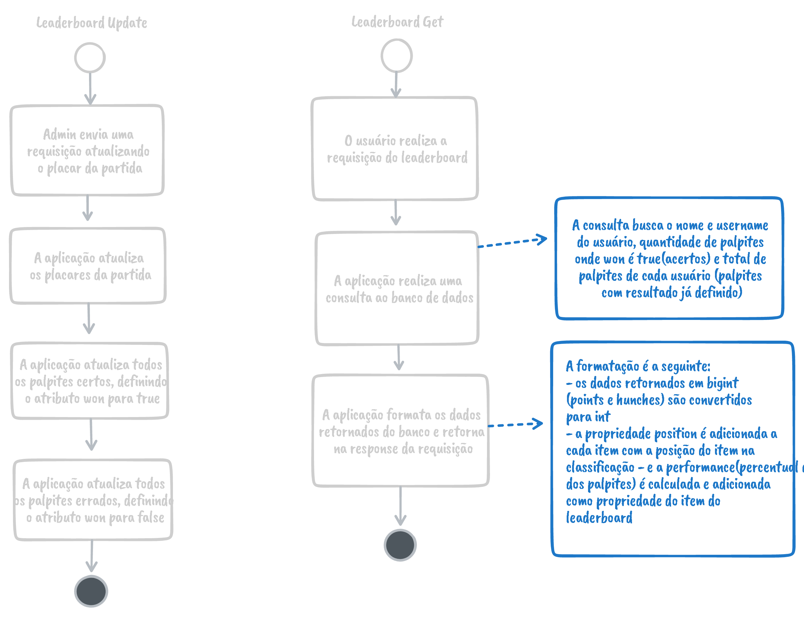
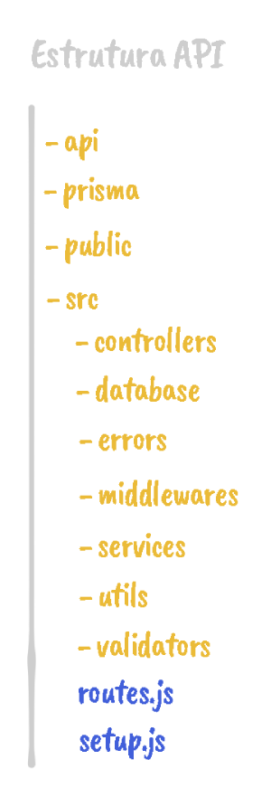

# NaTrave API
- [Overview](#overview)
    - [Sobre o projeto](#sobre-o-projeto)
    - [Como executar](#como-executar)
    - [Funcionalidades extras](#funcionalidades-extras)
        - [Leaderboard](#leaderboard)
        - [Manipulação de erros "Top Level"](#manipulação-de-erros-top-level)
        - [Organização em camadas](#organização-em-camadas)
        - [Validação de dados](#validação-de-dados)
        - [Bloqueio de envio após início da partida](#bloqueio-de-envio-após-início-da-partida)
        - [Roles de usuário](#roles-de-usuário)
    - [Tecnologias utilizadas](#tecnologias-utilizadas)
    - [Deploy](#deploy)

# Overview
## Sobre o projeto
Ao criar uma conta com o nome, usuário, email e senha o usuário pode começar a enviar 
seus palpites para os jogos da Copa do Mundo 2022 do Catar. É possível também visualizar 
os palpites de outros usuários na tela de perfil.

## Como executar
1. Para rodar o projeto localmente basta fazer o clone deste repositório em sua máquina local:
```
    git clone https://github.com/HenriqueFelixDev/na-trave-api.git
```
ou [fazer o download](https://github.com/HenriqueFelixDev/na-trave-api/archive/refs/heads/main.zip) (caso não tenha o git instalado em seu computador) e descompactar o arquivo baixado.

2. Após ter o projeto em sua máquina, entre no diretório/pasta do projeto e instale as dependências:
```
    npm install
```

3. Por fim, inicie a aplicação:
```
    npm start
```

> *Obs: Caso queira fazer o clone ou download do projeto do frontend, acesse o [repositório do frontend](https://github.com/HenriqueFelixDev/na-trave-frontend)*

## Funcionalidades extras

### Leaderboard
Uma das principais funcionalidades extras é a classificação dos usuários. Após o administrador cadastrar o resultado de uma partida, a aplicação atualiza o status do palpite (atributo won) de cada usuário, sendo true para os usuários que acertaram o palpite e false para os que erraram. É possível consultar no endpoint /v1/leaderboard a classificação do bolão, ordenada pela quantidade de acertos de cada usuário.

O processo de atualização e consulta da classificação é o seguinte:



Foi configurado um cache de 1 hora para esse endpoint no arquivo vercel.json. Os principais motivos foram:
 - Como é uma query mais complexa (com subqueries), requer mais processamento do banco de dados.
 - As partidas não são atualizadas constantemente(já que não há jogos no mesmo horário), por isso a classificação não muda com frequência.
 - Como o node não suporta o tipo bigint que é retornado do banco de dados na query do leaderboard (points e hunches), a cada consulta, o servidor executa um map que percorre cada item convertendo o bigint para int. Além disso, adiciona a cada item a propriedade position (índice do item + 1) e a performance (percentual de acerto dos palpites). Como é feito para cada usuário cadastrado no sistema, gera um processamento muito alto, que pode ser agravado em caso de um pico de uso da aplicação.

### Manipulação de erros "Top Level"
A aplicação conta um um middleware que captura as exceções e retorna para o client o status e uma mensagem "amigável". Para isso foi criada uma classe BaseError, em que todas as outras classes de erro customizadas a herdam. Ela possui um código (que será o status de retorno da requisição) e uma mensagem que será retornada no corpo da resposta da requisição. Quando a exceção lançada não herda de BaseError um statusCode 500 é lançado.

*Obs: Há o tratamento de uma exceção cuja propriedade status = 401. Essa exceção é referente à biblioteca koa-jwt, que automaticamente valida o token passado pelo client e lança essa exceção caso ocorra um erro.*

### Organização em camadas
O projeto foi organizado em camadas visando a separação de conceitos, de modo em que cada camada tenha uma função bem definida e seja fácil identificar onde uma alteração deve ser feita em uma futura manutenção do código. O diretório raiz do projeto possui os seguintes diretórios:



#### api
É o ponto de inicialização da aplicação. Poderia ser colocada no diretório src, porém a [Vercel](#deploy) exige que o arquivo de start da aplicação esteja no diretório api, onde eles colocarão as Serveless Functions.

#### prisma
Diretório com o arquivo de configuração do prisma (schema.prisma) e os seeds (dados iniciais do banco de dados).

#### public
Diretório com arquivos estáticos da aplicação. Nele estão as imagens das bandeiras de cada país.

#### src
Diretório com os arquivos do projeto. Ele possui alguns subdiretórios e arquivos:

##### controllers
Contém as funções que são chamadas em cada rota da aplicação.

##### database
Contém a instância do Prisma Client utilizada em toda a aplicação, de modo a evitar várias instância e assim, conexões simultâneas com o banco de dados

##### errors
Contém as classes de erros personalizados do sistema como UserNotFoundError, que herdam de BaseError.

##### middlewares
Contém os middlewares customizados da aplicação, como o ErrorMiddleware, para captura de exceções lançadas pela aplicação.

##### services
Contém os arquivos com as funções de manipulação do banco de dados.

##### utils
Contém os arquivos que abstraem alguma lógica da aplicação. Um exemplo é o cryptUtils que contém a lógica de criptografia de senha e comparação de uma senha em plaintext com um hash.

##### validators
Contém as funções de validação de cada objeto (hunch e user) e funções de validação para entidades genéricas (common validator)

##### routes.js
Arquivo com as rotas da aplicação. Separa as rotas em autenticadas e não autenticadas, onde as autenticadas exigem que o client envie o token JWT na requisição, caso contrário, um erro 401 é lançado.

##### setup.js
Contém a configuração da aplicação, com a inicialização do koa, definição dos middlewares, atribuição das rotas no koa, e expõe uma função startServer para ser usada no arquivo de inicialização da aplicação.

### Validação de dados
Todas as rotas que recebem dados, seja pelo body, query params ou de qualquer outra forma, possuem um middleware de validação de dados. Esse middleware recebe um objeto com validações do [Yup](https://github.com/jquense/yup) e realiza a validação. Caso algum dado esteja inválido, lança uma exceção do tipo EntityValidationError.

### Bloqueio de envio após início da partida
Quando o usuário tenta enviar um palpite após a data de início de uma partida uma exceção do tipo HunchAfterMatchStartError. Isso evita com que o usuário dê um palpite a cada gol marcado e acerte o resultado da partida.

### Roles de usuário
Algumas ações devem ser protegidas de usuários comuns e permitidas apenas para administradores. A atualização do resultado de uma partida é um exemplo delas. O middleware RoleMiddleware verifica a "role" a qual o usuário pertence, que pode ser default ou admin. Caso o usuário não tenha o nível de permissão necessário para acessar aquele recurso, uma exceção do tipo UnauthorizedError é lançada.

## Tecnologias utilizadas
### KoaJS
[koajs.com](https://koajs.com/)

Framework NodeJS para a construção de aplicações web e APIs. Uma das vantagens do Koa é que ele é muito leve, pois, diferente do express, possui apenas o necessário para a construção do servidor, sem recursos de roteamento, serviço de arquivos estáticos, etc. Para adicionar essas outras funcionalidades é necessários instalar outras bibliotecas como o koa-router, koa-static, etc.

### JWT
[jwt.io](https://jwt.io/)

Padrão para autenticação em que os dados recebem um encoding em Base64 e uma assinatura que permite verificar a integridade do token. O token deve ser enviado ho header Authorization da requisição, junto com a palavra Bearer (o tipo de token), para autenticar o usuário na API. Dados como id e nome de usuário podem ser colocados no payload do token, porém é importante saber que todas as informações de um token podem ser visualizadas por qualquer pessoa, já que ele não está criptografado, mas com um encoding em Base64.

### Bcrypt
[Repositório do Bcrypt no GitHub](https://github.com/kelektiv/node.bcrypt.js#readme)

Biblioteca para a criptografia de senhas. Ela permite criar um hash (senha criptografada) para salvar a senha de forma segura no banco de dados. Também possui uma função para comparar uma senha descriptografada (plaintext) com uma criptografada e verificar se são a mesma (útil para o login)

### Variáveis de ambiente

São dados que ficam armazenados no ambiente em que a aplicação está rodando (local ou servidor) e são úteis para armazenar informações sensíveis como url de conexão com o banco de dados ou informações que mudam de acordo com o ambiente como a URL da API, que pode ser uma API de testes no ambiente local e a API de produção no ambiente de produção.

### Prisma
[prisma.io](https://www.prisma.io/)

ORM (Object Relational Mapping) para NodeJS que simplifica a manipulação de bancos de dados. O Prisma suporta vários tipos de bancos de dados como MySQL, PostgreSQL, SQLite, MongoDB, etc. Toda a definição da estrutura e configuração do banco de dados fica em um arquivo schema.prisma que possui uma sintaxe própria do Prisma. Um objeto PrismaClient é gerado a partir desse schema, contendo as funções necessários para criar as queries do banco de dados.

### PlanetScale
[planetscale.com](https://planetscale.com/)

Banco de dados MySQL online e gratuito que possui recursos como uso de branchs (ter um banco de dados de desenvolvimento e um de produção, por exemplo), migrations, backups entre outros recursos.

### Yup
[Repositório do Yup no Github](https://github.com/jquense/yup)

Biblioteca para validação de dados. É altamente customizável, permitindo adicionar uma mensagem de erro personalizada para cada validação, além de possuir várias funções para validação de dados como email, required, min, max, url, etc.

### Nodemon
[nodemon.io](https://nodemon.io/)

Biblioteca que reinicia a aplicação automaticamente sempre que um arquivo é alterado. Isso agiliza o desenvolvimento pois não é preciso desligar e religar o servidor manualmente a cada alteração.

## Deploy
O deploy da aplicação foi feito na Vercel, que conta com um plano gratuito, integração com o GitHub (CI/CD), certificado SSL gratuito, entre diversos outros recursos. Após a configuração do projeto, todo push realizado no GitHub gera um novo deploy na Vercel. Além disso, por meio das Preview Branchs, é possível publicar diferentes versões da aplicação baseadas em diferentes branchs do GitHub.

A Vercel trabalha com Stateless Functions, ou seja, funções que não armazenam estados a cada execução. Cada chamada na API é iniciada, processada e os dados são retornados sem nada ficar armazenado no servidor. Uma configuração do arquivo vercel.json é necessária para indicar a Vercel para onde deve redirecionar as requisições, apontando para o arquivo index.js do servidor, que deve ficar no diretório api.


## Como rodar

Pré-requisitos
- npm / yarn
- Docker compose


1. Instale as dependências
> npm install

2. Inicie o servidor de banco de dados
> npm run docker-up

3. Inicie a aplicação 
> npm run dev

- Rode os testes 
> npm run test


